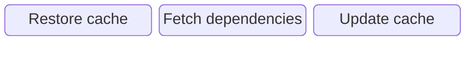
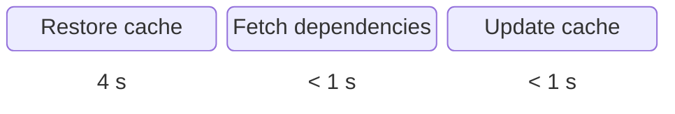
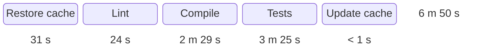

<AntiPattern :num="7" />

# Groundhog day
## Starting from scratch all the time

--- 
layout: center-content
---

# Antipattern #7: Groundhog day

::content::


---
layout: cover
background: /images/caching.webp
---

<AntiPattern :pattern="'Pattern'" :num="7" />

# Caching

--- 
layout: center-content
transition: fade

---

# Caching dependencies

::content::


<div v-click>




</div>

--- 
layout: center-content
---

# Caching dependencies

::content::





<!--

80 or so dependencies. Takes 5-8 seconds to download.
The caching steps taks around 5 seconds so the net saves is almost nothing

-->

--- 
layout: center-content
transition: fade
---

# Caching build output

::content::


<div v-click>


</div>

--- 
layout: center-content
---

# Caching build output

::content::




<!--

Saved slightly almost 4 and a half minutes in total

-->


---

# Caching container images

```bash
docker buildx build \
  --push \
  --tag my/image:latest \
  --cache-from type=registry,ref=my.registry/my/repo-cache:latest \
  --cache-to type=registry,ref=my.registry/my/repo-cache:latest \
  .
```

<v-clicks>

```console{all|5|8|10-14}
#7 importing cache manifest from my/repo-cache:latest
#7 inferred cache manifest type: application/vnd.oci.image.index.v1+json done
#7 DONE 1.2s

#8 [3/4] RUN cargo install --locked --git https://github.com/leptos-rs/cargo-leptos cargo-leptos
#8 extracting sha256:b0a0cf830b12453b7e15359a804215a7bcccd3788e2bcecff2a03af64bbd4df7 1.3s done
#8 extracting sha256:e62e6e54ca92f1c0e35a38988a00f7753207afcb1fc9106d95893324d7505fb5 4.3s done
#8 DONE 7.9s

#9 [4/4] RUN cargo install --locked cross
#9 0.092     Updating crates.io index
#9 0.360  Downloading crates ...
#9 0.681   Downloaded cross v0.2.5
#9 0.713   Installing cross v0.2.5
```

<!--

cargo install leptos ~6 minutes

-->

</v-clicks>

---
layout: center-content
---

# Pattern #8: Tooling images

::content::


---
layout: center-content
---

# Pattern #8: Tooling images

::content::

<h3 class="text-left">main</h3>


<div v-click>

<h3 class="text-left">
PR #387: Add index on user birthdates
</h3>


</div>

<div v-click>

<h3 class="text-left">
PR #392: Upgrade cross in the build pipeline
</h3>


</div>

<!--

NEVER have persistent state on the runners

-->