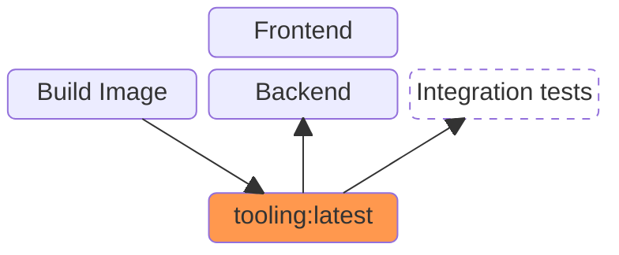
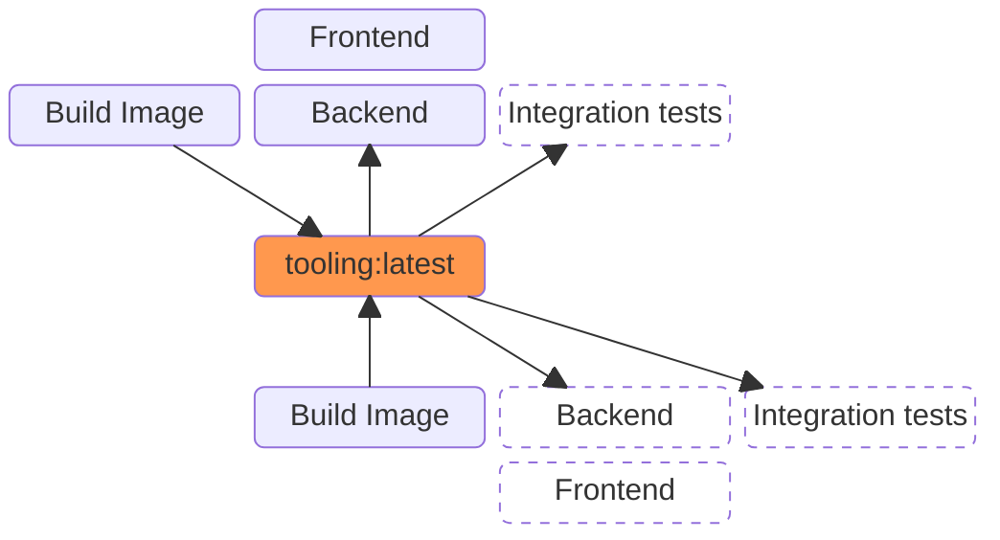
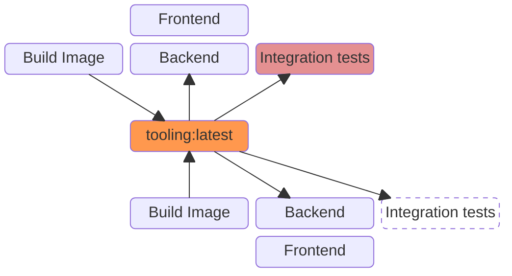

<AntiPattern :num="8" />

# Interference
## Colliding with other pipelines

---

#  Antipattern #8: Interference

```mermaid { theme: 'forest' }
block-beta
    columns 3
    space 1f("Frontend") space
    1bi("Build Image") 1b("Backend") 1it("Integration tests")
    space:3
    space r("tooling:latest") space
    
    1bi-->r
    r-->1b
    r-->1it
    
    style r fill: #ff984e
    style 1it stroke-dasharray: 5 5, fill: #ffffff
```

---

#  Antipattern #8: Interference

```mermaid { theme: 'forest' }
block-beta
    columns 4
    space 1f("Frontend") space:2
    1bi("Build Image") 1b("Backend") 1it("Integration tests") space
    space:4
    space r("tooling:latest") space:2
    space:4
    space 2bi("Build Image") 2b("Backend") 2it("Integration tests")
    space:2 2f("Frontend") space
    
    1bi-->r
    2bi-->r
    r-->1b
    r-->1it
    r-->2b
    r-->2it
    
    style r fill: #ff984e
    classDef pending stroke-dasharray: 5 5, fill: #ffffff
    class 1it,2b,2f,2it pending
```
---

#  Antipattern #8: Interference

```mermaid { theme: 'forest' }
block-beta
    columns 4
    space 1f("Frontend") space:2
    1bi("Build Image") 1b("Backend") 1it("Integration tests") space
    space:4
    space r("tooling:latest") space:2
    space:4
    space 2bi("Build Image") 2b("Backend") 2it("Integration tests")
    space:2 2f("Frontend") space
    
    1bi-->r
    2bi-->r
    r-->1b
    r-->1it
    r-->2b
    r-->2it
    
    style r fill: #ff984e
    classDef failed fill: #e49091
    class 1it failed
    classDef pending stroke-dasharray: 5 5, fill: #ffffff
    class 2it pending
```
