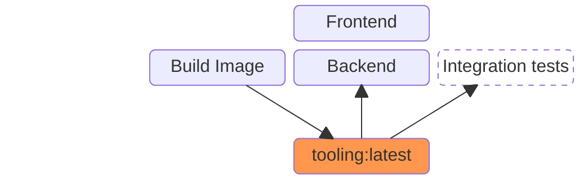
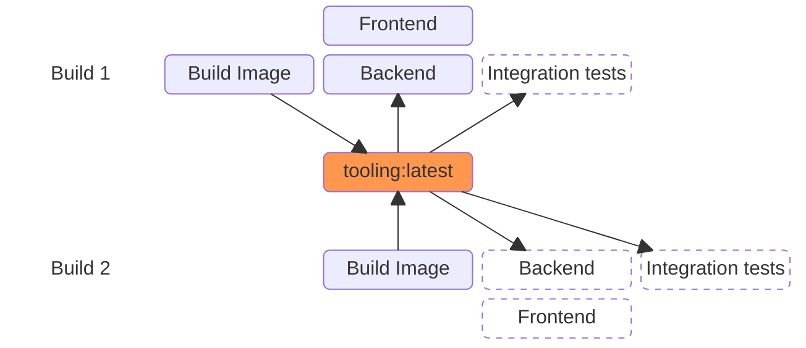
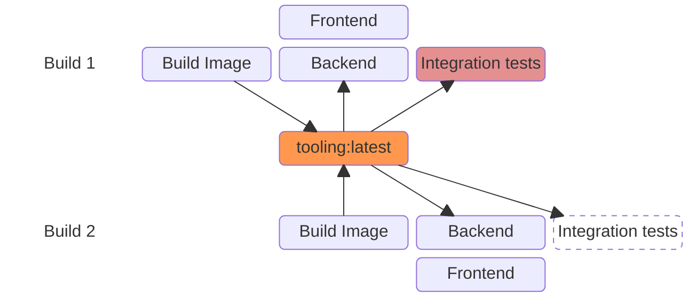

<AntiPattern :num="8" />

# Interference
## Colliding with other pipelines

---
transition: fade
---

#  Antipattern #8: Interference

---
transition: fade
---

#  Antipattern #8: Interference

---

#  Antipattern #8: Interference

---
layout: center-content
---

#  Antipattern #8: Interference

::content::

