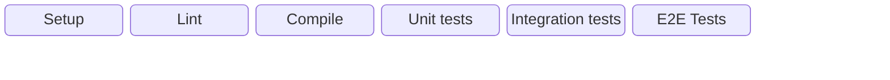
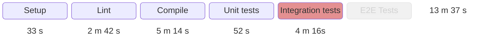
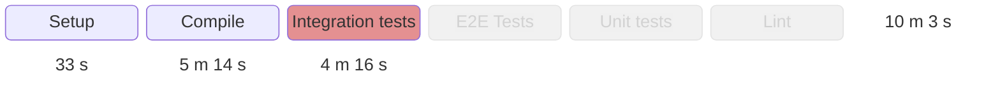

<AntiPattern :num="3" />

# The Aesthete
## "Natural" instead of practical ordering

---
layout: center-content
---

# Antipattern #3: The Aesthete

::content::

---
layout: center-content
---

# Antipattern #3: The Aesthete

::content::

---
layout: center-content
---

# Pattern #3: Failing fast

::content::

