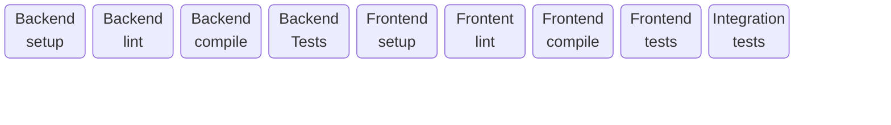
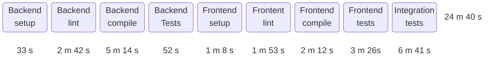
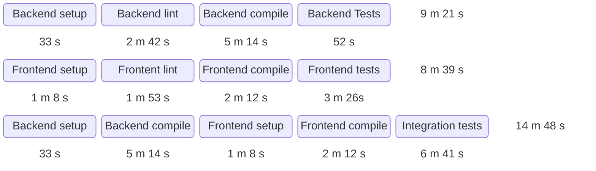

<AntiPattern :num="4" />

# The One Pipeline
## One pipeline to rule them all

---
layout: center-content
transition: fade
---

# Antipattern #4: The One Pipeline

::content::

---
layout: center-content
---

# Antipattern #4: The One Pipeline

::content::

---
layout: center-content
---

# Pattern #4: Parallel pipelines

::content::

<!--

10 minutes saved!
Total time: 32 m 48 s (+7 m 52 s)

-->
