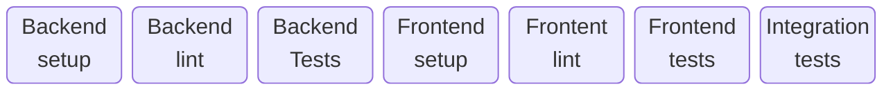
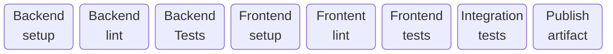
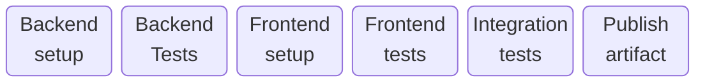
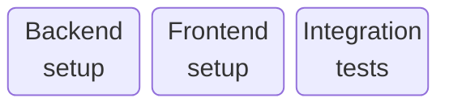
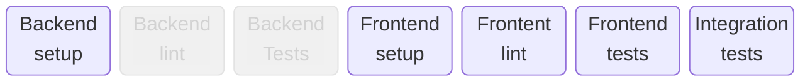
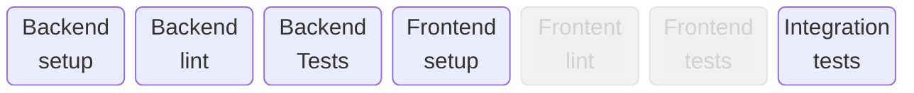

<AntiPattern :num="1" />

# The Ritual
## Doing everything all the time

---

# Antipattern #1: The Ritual

## PR


<div style="height: 2em">
</div>
<div v-click>

## Merge (main)


</div>
<div style="height: 2em">
</div>
<div v-click>

## Nightly


</div>

---

# Antipattern #1: The Ritual

## PR


<div style="height: 2em">
</div>

## Merge (main)


<div style="height: 2em">
</div>

## Nightly


---

# Pattern #1: The right pipeline for the job

## PR


<div style="height: 2em">
</div>

## Merge (main)


<div style="height: 2em">
</div>

## Nightly


<!--

PR: No artifact

Main: No linting

Nightly: Just integration tests

-->

---
layout: center-content
---

# Pattern #2: Conditional pipeline steps

::content::

## PR


---
layout: center-content
---

# Pattern #2: Conditional pipeline steps

::content::

## "Hide settings menu when logged out"


<div style="height: 2em">
</div>

## "Add index on user birthdate"


---

# Pattern #2: Conditional pipeline steps

```yaml{all|9-14|4-6|18,21-23}
jobs:
  paths-filter:
    runs-on: ubuntu-latest
    outputs:
      backend: ${{ steps.filter.outputs.backend }}
      frontend: ${{ steps.filter.outputs.frontend }}
    steps:
      - uses: actions/checkout@v4
      - uses: dorny/paths-filter@v3
        id: filter
        with:
          filters: |
            backend: ['backend/**']
            frontend: ['frontend/**']

  pr-pipeline:
    runs-on: ubuntu-latest
    needs: paths-filter
    steps:
        ...
      - name: Backend lint
        if: needs.paths-filter.outputs.backend == 'true'
        ...
```
